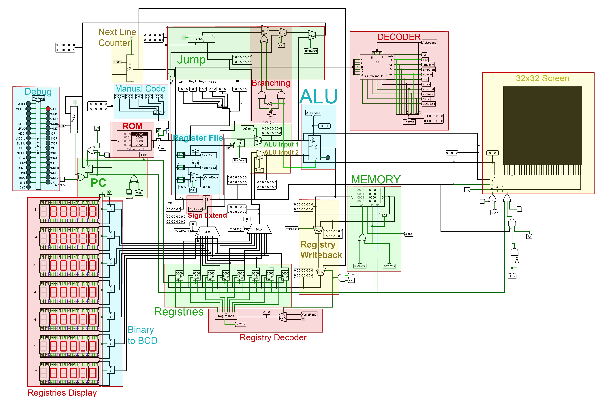

# cMips
#### by pidbaq (Cris Ghiurea)

## Compiler/Simulation
[https://c3cris.github.io/cmips](https://c3cris.github.io/cmips)

CMips is a proof of concept of a 16 bit subset of MIPS designed by [pidbaq](http://www.pidbaq.com).  cMips contains most features of a full working CPU using RISC design with a 32 by 32 bit monitor. 

Included in the repo you will find an assembler for easy programming.  It also contains demo code to get you started or you can use the web interface to assemble your own application.

## Installation

### Simulator

This repo uses logisim-win-2.7.1.exe simulator which can be found at:  [https://sourceforge.net/projects/circuit/files/](https://sourceforge.net/projects/circuit/files/)

#### Circuit

cMips.circ is the main logism file containing the CPU.

#### Rom Programs

* draw_checkers.dat 
  * Demonstates writing to the simulated monitor
* fib.dat
  * Calculates fibinacci's sequence until it overflows 
* mult_12345.dat
  * A demo of multiplication by addition. 

### cMips Dependencies

* Jquery 2.2.4 (included)
* Code Mirror
  * Install using **npm install codemirror**

### Screenshot

